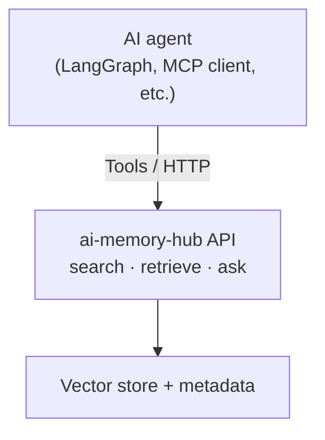

# AI agents and ai-memory-hub

This hub is a **memory layer** for AI agents: it stores conversations, supports semantic retrieval, and can answer questions with RAG over your personal history.

**Audience:** Builders wiring agents (LangGraph, Llama Stack, OpenAI Assistants, MCP, custom tools) to a single memory backend.

---

## What agents can do

- Retrieve past conversations
- Search for relevant context
- Summarize historical discussions
- Extract facts, decisions, or plans
- Build timelines
- Maintain continuity across sessions

**Example prompts users might run through an agent:**

- “What did I say about upgrading my GPU last month?”
- “Find all conversations where I discussed FastAPI RAG.”
- “Summarize everything I learned about Llama Stack.”

---

## Interaction model

Agents talk to the hub **only through its HTTP API**. They do **not** read raw export files or database files directly.

| Operation | Method | Path | Role |
|-----------|--------|------|------|
| Search | `POST` | `/search` | Semantic search across stored conversations |
| Retrieve | `GET` | `/conversation/{id}` | Fetch one conversation (or message scope the API defines) |
| Ask (RAG) | `POST` | `/ask` | Retrieval-augmented answer over memory |

### Search

Semantic search over stored conversations.

```http
POST /search
Content-Type: application/json
```

```json
{
  "query": "gpu upgrade"
}
```

### Retrieve

Load a specific conversation by identifier (exact shape of `{id}` and response follows your deployed API contract).

```http
GET /conversation/{id}
```

### Ask (RAG run query + optional retrieval limits)

```http
POST /ask
Content-Type: application/json
```

```json
{
  "query": "What were my plans for the PC upgrade?",
  "top_k": 5
}
```

`top_k` controls how many chunks or hits to pull into context before generation (if your server supports it).

---

## Architecture (conceptual)



Plain-text equivalent:

```
+---------------------+
|     AI agent        |
| (LangGraph, MCP…)   |
+----------+----------+
           |
           | Tools / HTTP
           v
+-----------------------------+
|     ai-memory-hub API       |
|  search / retrieve / ask    |
+----------+------------------+
           |
           v
+-----------------------------+
|   Vector store + metadata   |
+-----------------------------+
```

---

## Integration notes

- **Tools:** Expose `search`, `retrieve`, and `ask` as function/tool calls your agent can choose based on the user task.
- **MCP:** If you add an MCP server in front of this API, map each tool to the corresponding method and path above.
- **Safety:** Treat the hub like any other backend: validate inputs, handle errors and timeouts, and avoid logging full message bodies if logs are shared.

For ingestion, normalization, and local-first setup, see the project [README](../README.md).
