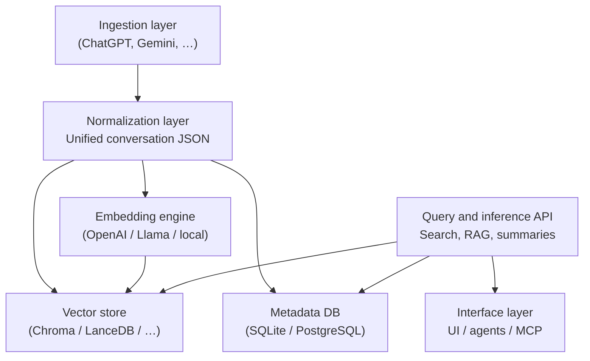

# ai-memory-hub — architecture

**ai-memory-hub** is a local-first memory engine that unifies AI conversations from multiple platforms into one searchable, RAG-ready knowledge hub. This document describes subsystems, data flow, the canonical schema, API surface, extensibility, and privacy assumptions.

**Related docs:** [Agent integration (HTTP tools)](agents.md) · [Project overview](../README.md)

---

## At a glance (humans)

| Layer | Responsibility |
|--------|----------------|
| Ingestion | Import raw exports; platform-specific parsers |
| Normalization | One unified conversation JSON + chunking metadata |
| Storage | Vector index (semantic) + metadata DB (records, filters) |
| Query & inference | Search, RAG, optional summarization / topics |
| Interfaces | HTTP API, optional UI, agents, MCP tools |

Design principle: **modules are swappable** — parsers, vector stores, embedding providers, and interfaces can be extended without rewriting the whole stack.

---

## At a glance (agents)

Use these grounded facts when reasoning about the system (spec / target design; a given repo checkout may not implement every piece yet):

- **Data plane:** exports → parsers → **unified schema** → chunks + embeddings → **vector store** + **metadata DB**.
- **Query plane:** `POST /search` (retrieve chunks), `POST /ask` (RAG), `GET /conversation/{id}` (fetch record).
- **Privacy default:** local-first; no mandatory cloud; no telemetry described in this architecture.
- **Extension:** new sources = new parser module; new backends = implement store/provider interfaces.
- **Agent-facing detail:** endpoint shapes and agent usage patterns are summarized in [agents.md](agents.md).

---

## High-level diagram



ASCII equivalent:

```
                +---------------------------+
                |     Ingestion layer       |
                |  (ChatGPT, Gemini, etc.)  |
                +-------------+-------------+
                              |
                              v
                +---------------------------+
                |    Normalization layer    |
                |  Unified conversation JSON |
                +-------------+-------------+
                              |
                              v
        +---------------------+----------------------+
        |                                            |
        v                                            v
+------------------+                      +----------------------+
|   Vector store   | <--- embeddings ---- |   Embedding engine   |
| (Chroma/LanceDB) |                      | (OpenAI/Llama/local) |
+---------+--------+                      +----------+-----------+
          |                                           |
          +---------------------+---------------------+
                                |
                                v
                +---------------------------+
                |   Query & inference API   |
                |  (Search, RAG, summaries)  |
                +-------------+-------------+
                              |
                              v
                +---------------------------+
                |   Interface layer           |
                |  UI / agents / MCP tools    |
                +---------------------------+
```

---

## 1. Ingestion layer

Imports conversations from multiple AI platforms. Each platform has its own parser module.

**Planned layout (example):**

```text
ingestion/
  chatgpt_parser.py
  gemini_parser.py
  copilot_parser.py
  claude_parser.py
  local_llm_parser.py
```

**Responsibilities:**

- Read raw exports (ZIP, JSON, HTML, Takeout, etc.)
- Extract message threads
- Capture metadata (timestamps, roles, sources)
- Emit objects for the normalization layer

**Design goals:**

- **Modular:** one parser per platform
- **Fault-tolerant:** tolerate malformed or partial exports
- **Extensible:** add new platforms without changing unrelated code

---

## 2. Normalization layer

All ingested data is converted into a **unified schema**. Example:

```json
{
  "id": "uuid",
  "source": "chatgpt",
  "timestamp": "2026-03-29T10:00:00Z",
  "messages": [
    { "role": "user", "text": "..." },
    { "role": "assistant", "text": "..." }
  ],
  "metadata": {
    "tags": [],
    "topics": [],
    "imported_at": "2026-03-29T11:00:00Z"
  }
}
```

**Responsibilities:**

- Enforce consistent structure across platforms
- Clean and sanitize text
- Split long threads into **chunks** suitable for embedding
- Enrich metadata (topics, tags, timestamps)

---

## 3. Storage layer

Two conceptual parts: **vector index** and **metadata store**.

### 3.1 Vector store

Stores **embeddings** for semantic search.

**Typical backends (configurable):**

- ChromaDB (often a default in designs like this)
- LanceDB
- pgvector
- Milvus (optional)

**Responsibilities:**

- Persist embeddings
- Similarity search (`top_k`)
- Return scored chunks for search and RAG

### 3.2 Metadata database

Stores **normalized conversation records** and supports filtering.

**Typical backends:**

- SQLite (local default)
- PostgreSQL (optional)

**Responsibilities:**

- Store normalized objects and linkage to chunks
- Fast lookup by ID
- Filters: source, date range, tags, etc.

---

## 4. Query and inference layer

### 4.1 Semantic search

```http
POST /search
Content-Type: application/json
```

```json
{
  "query": "gpu upgrade",
  "top_k": 5
}
```

**Typical pipeline:**

1. Embed the query
2. Vector search (`top_k`)
3. Optional reranking
4. Return relevant chunks (and IDs for citation)

### 4.2 RAG (retrieval-augmented generation)

```http
POST /ask
Content-Type: application/json
```

```json
{
  "query": "What were my PC upgrade plans?",
  "top_k": 5
}
```

**Typical pipeline:**

1. Semantic search for context
2. Build a context window
3. Call an LLM to generate an answer
4. Return answer **with citations** / source references where supported

**Common model backends:**

- OpenAI APIs
- Llama Stack
- Local runners (Ollama, LM Studio, custom HTTP endpoints)

### 4.3 Summaries and topic extraction (optional)

- Conversation summaries
- Topic clustering
- Timeline reconstruction
- Memory consolidation

These are **additive** capabilities on top of search/RAG.

---

## 5. Interface layer

### 5.1 HTTP API (e.g. FastAPI)

Illustrative endpoint set:

| Method | Path | Purpose |
|--------|------|---------|
| *varies* | `/ingest` | Accept exports / payloads for parsing |
| `POST` | `/search` | Semantic search |
| `POST` | `/ask` | RAG query |
| `GET` | `/conversation/{id}` | Fetch one conversation |
| *varies* | `/stats` | Usage / index statistics |
| `GET` | `/health` | Liveness / readiness |

Exact request/response contracts belong in OpenAPI or code; [agents.md](agents.md) focuses on agent-facing usage.

### 5.2 UI (optional)

A lightweight dashboard may support:

- Uploading exports
- Browsing conversations
- Running searches and `/ask`
- Inspecting relationships or timelines (future)

### 5.3 Agent integration

Agents treat the hub as a **memory provider** via HTTP tools or wrappers. Common ecosystem integrations:

- LangGraph
- Llama Stack
- OpenAI Assistants (function calling)
- MCP (Model Context Protocol)

### 5.4 MCP provider (target)

Exposed tool names might include:

- `memory.search`
- `memory.retrieve`
- `memory.summarize`
- `memory.timeline`

Any MCP-compatible client can call these once the server implements them.

---

## Security and privacy model

- **Local-first by default** — data stays on the user’s machine unless they configure otherwise.
- **No mandatory cloud sync** in the baseline design.
- **No telemetry** assumed in this architecture.
- **External calls** only where the user opts into remote embeddings or LLMs.
- **User owns the data** — the hub is a personal memory layer, not a shared multi-tenant product by default.

---

## Extensibility model

| Change | Typical approach |
|--------|------------------|
| New ingestion source | Add `ingestion/<source>_parser.py` (or equivalent) |
| New vector store | Implement the project’s `VectorStore` interface |
| New embedding provider | Implement `EmbeddingProvider` (or equivalent) |
| New agent capabilities | Add HTTP routes and/or MCP tools; keep contracts explicit |

---

## Future enhancements

- Memory graphs (entity linking)
- Automatic memory consolidation
- Relevance decay over time
- Multi-agent shared memory (explicit sharing policy)
- UI timeline view
- Local embedding models as first-class
- Formal plugin system

---

## Summary

**ai-memory-hub** is structured as a **modular, local-first** pipeline:

1. **Ingest** multi-platform exports
2. **Normalize** to a single schema
3. **Embed** and **store** vectors + metadata
4. **Query** via search and RAG
5. **Expose** APIs, UI, and agent/MCP interfaces

It is meant to scale from a **personal tool** to a fuller **memory platform** as components land.
